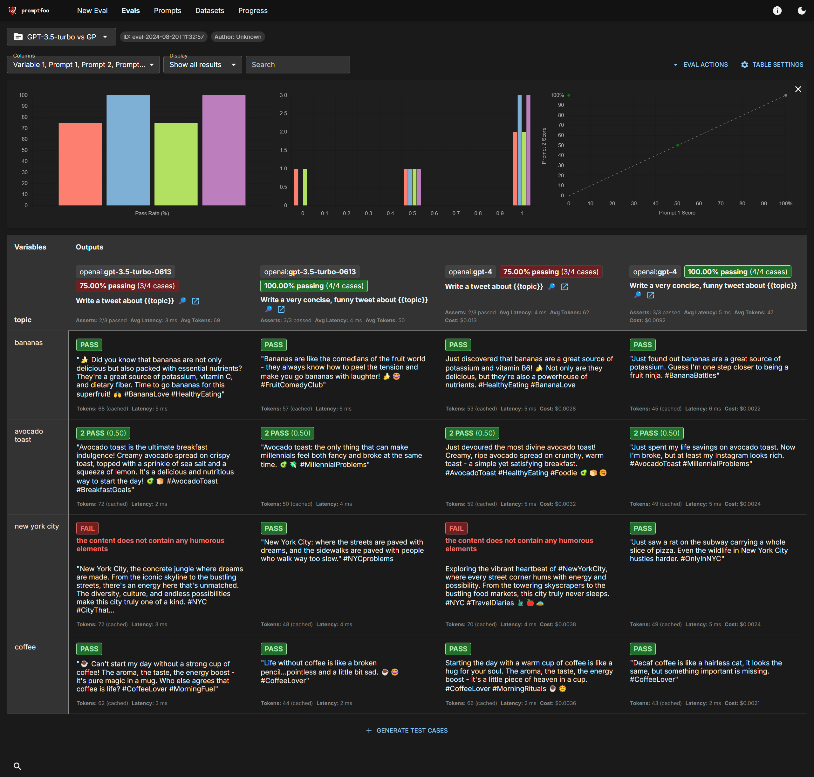

# promptfoo

Promptfoo is an LLM vulnerability scanner and "LLM Red Teaming" tool.

This example contains a comparison using a couple of promptfoo evaluations against OpenAI GPT-3.5-turbo and GPT-4.

## Usage

```bash
# Run container to show report with evaluation already done
make container-run
# Then open a browser to: http://localhost:15500
```

## Example evaluation

Example web report:


Example command line evaluation:
```
┌──────────────────────┬──────────────────────┬──────────────────────┬──────────────────────┬──────────────────────┐
│ topic                │ [openai:gpt-3.5-tur… │ [openai:gpt-3.5-tur… │ [openai:gpt-4] Write │ [openai:gpt-4] Write │
│                      │ Write a tweet about  │ Write a very         │ a tweet about        │ a very concise,      │
│                      │ {{topic}}            │ concise, funny tweet │ {{topic}}            │ funny tweet about    │
│                      │                      │ about {{topic}}      │                      │ {{topic}}            │
├──────────────────────┼──────────────────────┼──────────────────────┼──────────────────────┼──────────────────────┤
│ bananas              │ [PASS] "🍌 Did you   │ [PASS] "Bananas are  │ [PASS] Just          │ [PASS] "Just found   │
│                      │ know that bananas    │ like the comedians   │ discovered that      │ out bananas are a    │
│                      │ are not only         │ of the fruit world - │ bananas are a great  │ great source of      │
│                      │ delicious but also   │ they always know how │ source of potassium  │ potassium. Guess I'm │
│                      │ packed with          │ to peel the tension  │ and vitamin B6! 🍌   │ one step closer to   │
│                      │ essential nutrients? │ and make you go      │ Not only are they    │ being a fruit ninja. │
│                      │ They're a great      │ bananas with         │ delicious, but       │ #BananaBattles"      │
│                      │ source of potassium, │ laughter! 🍌😂       │ they're also a       │                      │
│                      │ vitamin C, and       │ #FruitComedyClub"    │ powerhouse of        │                      │
│                      │ dietary fiber. Time  │                      │ nutrients.           │                      │
│                      │ to go bananas for    │                      │ #HealthyEating       │                      │
│                      │ this superfruit! 🙌  │                      │ #BananaLove          │                      │
│                      │ #BananaLove          │                      │                      │                      │
│                      │ #HealthyEating"      │                      │                      │                      │
├──────────────────────┼──────────────────────┼──────────────────────┼──────────────────────┼──────────────────────┤
│ avocado toast        │ [PASS] "Avocado      │ [PASS] "Avocado      │ [PASS] Just devoured │ [PASS] "Just spent   │
│                      │ toast is the         │ toast: the only      │ the most divine      │ my life savings on   │
│                      │ ultimate breakfast   │ thing that can make  │ avocado toast!       │ avocado toast. Now   │
│                      │ indulgence! Creamy   │ millennials feel     │ Creamy, ripe avocado │ I'm broke, but at    │
│                      │ avocado spread on    │ both fancy and broke │ spread on crunchy,   │ least my Instagram   │
│                      │ crispy toast, topped │ at the same time.    │ warm toast - a       │ looks rich.          │
│                      │ with a sprinkle of   │ 🥑💸                 │ simple yet           │ #AvocadoToast        │
│                      │ sea salt and a       │ #MillennialProblems" │ satisfying           │ #MillennialProblems" │
│                      │ squeeze of lemon.    │                      │ breakfast.           │                      │
│                      │ It's a delicious and │                      │ #AvocadoToast        │                      │
│                      │ nutritious way to    │                      │ #HealthyEating       │                      │
│                      │ start the day! 🥑🍞  │                      │ #Foodie 🥑🍞😋       │                      │
│                      │ #AvocadoToast        │                      │                      │                      │
│                      │ #BreakfastGoals"     │                      │                      │                      │
├──────────────────────┼──────────────────────┼──────────────────────┼──────────────────────┼──────────────────────┤
│ new york city        │ [FAIL] the content   │ [PASS] "New York     │ [FAIL] the content   │ [PASS] "Just saw a   │
│                      │ does not contain any │ City: where the      │ does not contain any │ rat on the subway    │
│                      │ humorous elements    │ streets are paved    │ humorous elements    │ carrying a whole     │
│                      │ ---                  │ with dreams, and the │ ---                  │ slice of pizza. Even │
│                      │ "New York City, the  │ sidewalks are paved  │ Exploring the        │ the wildlife in New  │
│                      │ concrete jungle      │ with people who walk │ vibrant heartbeat of │ York City hustles    │
│                      │ where dreams are     │ way too slow."       │ #NewYorkCity, where  │ harder. #OnlyInNYC"  │
│                      │ made. From the       │ #NYCproblems         │ every street corner  │                      │
│                      │ iconic skyline to    │                      │ hums with energy and │                      │
│                      │ the bustling         │                      │ possibility. From    │                      │
│                      │ streets, there's an  │                      │ the towering         │                      │
│                      │ energy here that's   │                      │ skyscrapers to the   │                      │
│                      │ unmatched. The       │                      │ bustling food        │                      │
│                      │ diversity, culture,  │                      │ markets, this city   │                      │
│                      │ and endless          │                      │ truly never s...     │                      │
│                      │ possibi...           │                      │                      │                      │
├──────────────────────┼──────────────────────┼──────────────────────┼──────────────────────┼──────────────────────┤
│ coffee               │ [PASS] "☕️ Can't    │ [PASS] "Life without │ [PASS] Starting the  │ [PASS] "Decaf coffee │
│                      │ start my day without │ coffee is like a     │ day with a warm cup  │ is like a hairless   │
│                      │ a strong cup of      │ broken               │ of coffee is like a  │ cat, it looks the    │
│                      │ coffee! The aroma,   │ pencil...pointless   │ hug for your soul.   │ same, but something  │
│                      │ the taste, the       │ and a little bit     │ The aroma, the       │ important is         │
│                      │ energy boost - it's  │ sad. ☕️😂           │ taste, the energy    │ missing.             │
│                      │ pure magic in a mug. │ #CoffeeLover"        │ boost - it's a       │ #CoffeeLover"        │
│                      │ Who else agrees that │                      │ little piece of      │                      │
│                      │ coffee is life?      │                      │ heaven in a cup.     │                      │
│                      │ #CoffeeLover         │                      │ #CoffeeLover         │                      │
│                      │ #MorningFuel"        │                      │ #MorningRituals      │                      │
│                      │                      │                      │ ☕️🌞                │                      │
└──────────────────────┴──────────────────────┴──────────────────────┴──────────────────────┴──────────────────────┘
```

## More information

* https://www.promptfoo.dev/docs/getting-started/
* https://www.promptfoo.dev/docs/guides/prevent-llm-hallucations/
* https://promptfoo.dev/docs/configuration/expected-outputs/model-graded/
* https://promptfoo.dev/docs/guides/factuality-eval/
* https://github.com/promptfoo/promptfoo/tree/main/examples/self-grading
* https://github.com/promptfoo/promptfoo/tree/main/examples/simple-cli
* [HaluEval: A Large-Scale Hallucination Evaluation Benchmark for Large Language Models](https://arxiv.org/abs/2305.11747)
* [Practical Steps to Reduce Hallucination and Improve Performance of Systems Built with Large Language Models](https://medium.com/@victor.dibia/practical-steps-to-reduce-hallucination-and-improve-performance-of-systems-built-with-large-5d2bcadeba61)
* [Asemantic Induction of Hallucinations in Large Language Models](https://medium.com/starschema-blog/asemantic-induction-of-hallucinations-in-large-language-models-c92ef5030714)
* [‘AI package hallucination’ can spread malicious code into developer environments](https://www.scmagazine.com/news/ai-package-hallucination-malicious-code-developer-environments)
* [AI hallucinates software packages and devs download them – even if potentially poisoned with malware](https://www.theregister.com/2024/03/28/ai_bots_hallucinate_software_packages/)

